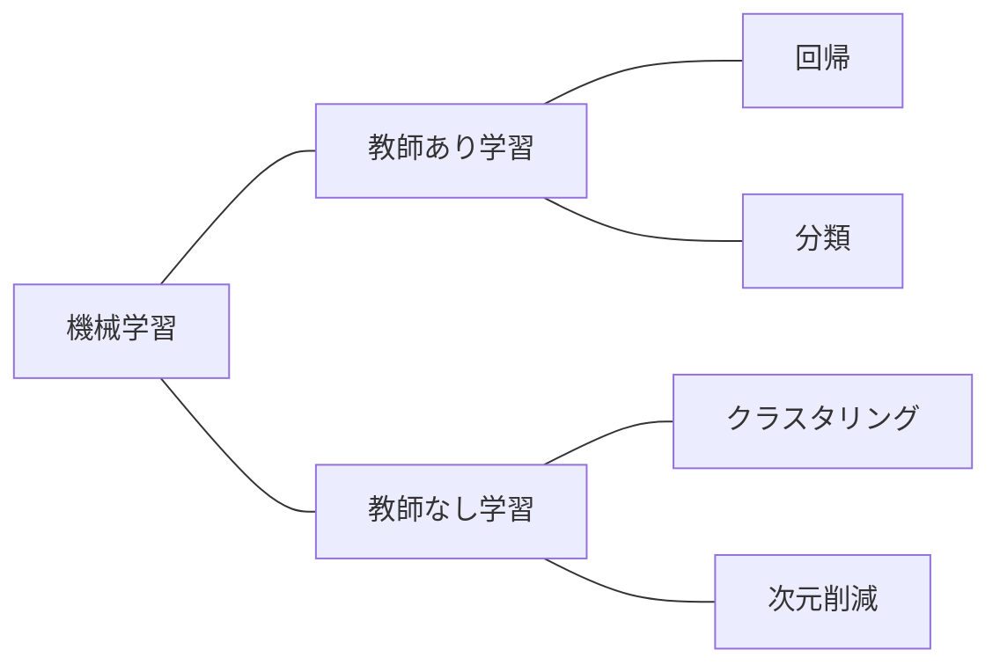

機械学習ライブラリ。さまざまな機械学習モデルを
1. モデル生成
2. 最適化（学習): fit
3. モデルを用いた演算: predict or transform
という一貫した記法で利用できる。



```python
import numpy as np
import pandas as pd
import matplotlib.pyplot as plt
import seaborn as sns
```

### データ前処理
- 標準化：平均を0に、標準偏差を1にスケーリング
	```python
	from sklearn.preprocessing import StandardScaler
	sc = StandardScaler()
	sc.fit(df)
	df_fitted = pd.DataFrame(sc.transform(df), columns=df_wine.columns)
	```

- 正規化：最大値を1に、最小値を0（または-1）にスケーリング
	```python
	from sklearn.preprocessing import MinMaxScaler
	ms = StandardScaler([0,1])
	ms.fit(df)
	df_fitted = pd.DataFrame(ms.transform(df), columns=df_wine.columns)
	```

- ラベルエンコーディング
	```python
	from sklearn.preprocessing import LabelEncoder
	le = LabelEncoder()
	df['列名'] = le.fit(df['カテゴリ変数列']).transform(df['カテゴリ変数列'])
	```

### データ分割
- 最もシンプルな分割
	```python
	from sklearn.model_selection import train_test_split
	train_data,test_data = train_test_split(df,train_size = 0.6 ,random_state=0)	# 訓練データ:テストデータ=4:6に分割
	```

### 教師あり学習　 **回帰・分類**
- 線形回帰
	```python
	from sklearn.linear_model import LinearRegression
	clf = LinearRegression()

	from sklearn.linear_model import LinearRegression
	clf = LinearRegression()	# モデル生成

	### 単回帰
	x, y = iris[['Petal.Length']].values, iris['Petal.Width'].values	# 説明変数、目的変数をnumpyのarrayで用意
	clf.fit(x, y)	# 最適化（学習）

	print(clf.coef_[0], clf.intercept_)	# 説明変数の係数、切片

	### 重回帰
	x, y = iris[['Sepal.Length', 'Sepal.Width']].values, iris['Petal.Width'].values
	clf.fit(x, y)

	print(clf.coef_, clf.intercept_)
	```

- ロジスティック回帰
- ランダムフォレスト
- サポートベクタマシン
- K近傍法

### 教師なし学習　**クラスタリング・次元削減**
- PCA
	```python
	from sklearn.decomposition import PCA
	pca = PCA()

	arr = iris[['Sepal.Length', 'Sepal.Width', 'Petal.Length', 'Petal.Width']].values
	pca.fit(arr)
	res = pca.transform(arr)
	```

- K-means
- t-SNE
